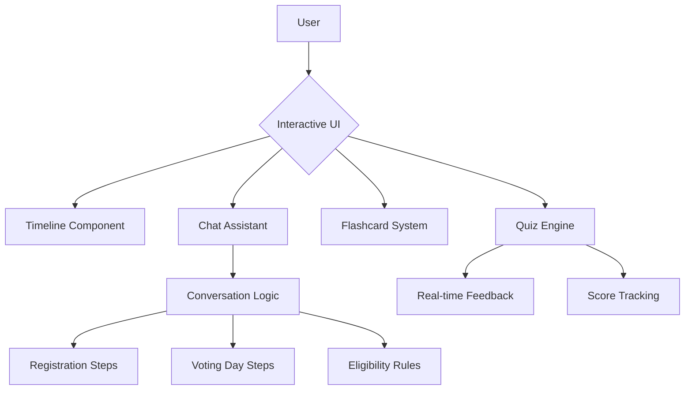

# Master the Indian Election Process 🇮🇳

An interactive, premium web application designed to educate citizens about the Indian election system, registration timelines, and voting procedures.

## 🚀 Live Demo
**App URL:** [https://election-assistant-1002801955290.us-central1.run.app](https://election-assistant-1002801955290.us-central1.run.app)

---

## 🌟 Key Features

### 1. Interactive Election Timeline
A visual walkthrough of the 10 critical stages of an Indian election, from the delimitation of constituencies to the declaration of results.

### 2. Knowledge Flashcards
3D-flipping cards that explain essential election terminology:
- **EVM**: Electronic Voting Machine
- **VVPAT**: Voter Verifiable Paper Audit Trail
- **NOTA**: None Of The Above
- **Indelible Ink**: The mark of a responsible citizen

### 3. Interactive Quiz Engine
Test your knowledge of the Indian Constitution and election rules with a real-time scoring system and instant feedback.

### 4. Guided Chat Assistant
A conversational interface that provides step-by-step instructions for:
- **Voter Registration** (Form 6, EPIC card)
- **Finding your name** in the Electoral Roll
- **Voting Day Procedures** at the polling booth

---

## 🏗️ Architecture



---

## 🛠️ Tech Stack
- **Frontend**: HTML5, CSS3 (Vanilla), JavaScript (ES6+)
- **Design**: Premium Dark Mode with Glassmorphism
- **Deployment**: Google Cloud Run (Containerized via Nginx)
- **Containerization**: Docker

---

## 📦 Local Setup

1. **Clone the repository**:
   ```bash
   git clone https://github.com/24A31A05EJ/Master-the-Indian-Election-Process.git
   cd Master-the-Indian-Election-Process
   ```

2. **Run locally**:
   Simply open `index.html` in any modern web browser.

---

## ☁️ Deployment (Cloud Run)

The project is containerized using Nginx and can be deployed to Google Cloud Run with:

```bash
gcloud run deploy election-assistant --source . --port 8080
```

---

## 📜 License
Sourced from official Election Commission of India (ECI) guidelines. Educational use only.
